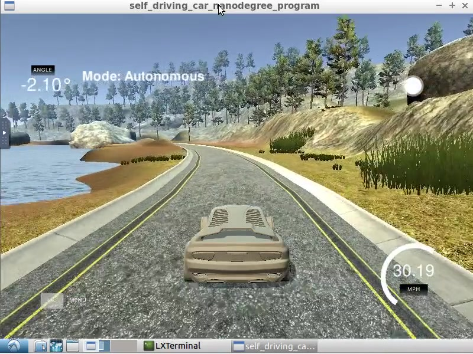

# Behavioral Cloning

In this project CNN model is cloning human style of steering control. This is an assignment of Self Driving Car Engineer nano degree course offered by Udacity. Transfer learning approch is used. Pretrained "MobileNet" model is used. For details see
[writeup](https://github.com/pchandra90/CarND-Behavioral-Cloning/blob/master/writeup.md)

---

## Requirnments

- [CarND Term1 Starter Kit](https://github.com/udacity/CarND-Term1-Starter-Kit)
- python3
- opencv
- tensorflow
- keras
